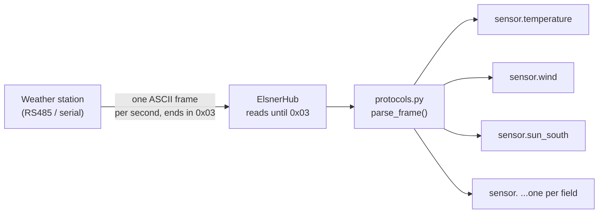

# Elsner Weather Station (P03/3-RS485)

A Home Assistant custom integration for the **Elsner P03/3-RS485** weather
station family (temperature, wind, sun brightness, rain, daylight). It talks
to the station over its RS485/serial output and exposes each measurement as
its own Home Assistant sensor entity — no `template:` sensors or manual
string-slicing required.

Supports the **CET** variant out of the box. The **GPS** and **plain**
variants are stubbed in and can be added without touching the integration's
core logic — see [Adding another variant](#adding-another-variant) below.

## How it works

The weather station streams one ASCII frame per second, terminated with an
ETX (`0x03`) byte. The integration opens the serial port once, reads frame
by frame, decodes it according to the selected protocol, and fans the parsed
values out to one sensor entity per field:



Reading frame-by-frame (rather than a fixed byte count) matters because the
frame length differs per protocol variant and because a fixed-size read can
drift out of sync with the actual frame boundaries over time.

## Installation

1. Copy the `elsner` folder into `<config_dir>/custom_components/elsner/`,
   so you end up with `<config_dir>/custom_components/elsner/manifest.json`,
   `sensor.py`, `protocols.py`, etc.
2. Restart Home Assistant.
3. Add a `sensor:` entry to your `configuration.yaml` (see below).
4. Restart Home Assistant again so the new requirement
   (`pyserial-asyncio-fast`) is installed.

## Configuration

```yaml
# configuration.yaml
sensor:
  - platform: elsner
    name: weather_station
    serial_port: /dev/ttyACM1
    #variant: cet   # optional, "cet" is the default
```

| Parameter      | Required | Default            | Description                                                                                     |
|----------------|:--------:|---------------------|---------------------------------------------------------------------------------------------------|
| `platform`     | yes      | –                   | Must be `elsner`.                                                                                  |
| `serial_port`  | yes      | –                   | Path to the serial device the station is connected to, e.g. `/dev/ttyACM1` or `/dev/ttyUSB0`.     |
| `name`         | no       | `Weather station`   | Base name used as a prefix for every generated entity, e.g. `weather_station` → `sensor.weather_station_temperature`. |
 

The baud rate (19200) is fixed to match the station's datasheet and isn't
configurable.

> **Multiple stations:** add a second `- platform: elsner` block with its
> own `serial_port` and a different `name`; each block gets its own serial
> connection and its own set of entities.

## Entities

With `name: weather_station` and `variant: cet`, the integration creates:

| Entity                                | Type    | Unit  | Description                                  |
|----------------------------------------|---------|-------|-----------------------------------------------|
| `sensor.weather_station_temperature`   | float   | °C    | Outdoor temperature                           |
| `sensor.weather_station_wind`          | float   | m/s   | Wind speed                                    |
| `sensor.weather_station_sun_south`     | int     | klx   | South-facing brightness sensor                |
| `sensor.weather_station_sun_west`      | int     | klx   | West-facing brightness sensor                 |
| `sensor.weather_station_sun_east`      | int     | klx   | East-facing brightness sensor                 |
| `sensor.weather_station_daylight`      | int     | lx    | General daylight level                        |
| `sensor.weather_station_twilight`      | bool    | –     | `true` below ~10 lx                           |
| `sensor.weather_station_rain`          | bool    | –     | `true` while the heated rain sensor is wet    |
| `sensor.weather_station_weekday`       | str     | –     | ISO weekday of the station's clock, `1`–`7`   |
| `sensor.weather_station_day`           | int     | –     | Day of month (station's clock)                |
| `sensor.weather_station_month`         | int     | –     | Month (station's clock)                       |
| `sensor.weather_station_year`          | int     | –     | Two-digit year (station's clock)              |
| `sensor.weather_station_hour`          | int     | –     | Hour (station's clock, CET)                   |
| `sensor.weather_station_minute`        | int     | –     | Minute                                        |
| `sensor.weather_station_second`        | int     | –     | Second                                        |
| `sensor.weather_station_summer_time`   | str     | –     | `J` = daylight saving active, `N` = not, per the station's clock |

Wind is reported in m/s straight from the datasheet; multiply by 3.6 in a
template sensor if you'd rather have km/h.

### Example Lovelace card

```yaml
type: entities
title: Weather station
entities:
  - sensor.weather_station_temperature
  - sensor.weather_station_wind
  - sensor.weather_station_sun_south
  - sensor.weather_station_sun_west
  - sensor.weather_station_sun_east
  - sensor.weather_station_daylight
  - sensor.weather_station_twilight
  - sensor.weather_station_rain
  - sensor.weather_station_weekday
  - sensor.weather_station_day
  - sensor.weather_station_month
  - sensor.weather_station_year
  - sensor.weather_station_hour
  - sensor.weather_station_minute
  - sensor.weather_station_second
  - sensor.weather_station_summer_time
```

## Architecture

The integration is split into three layers so that supporting another
protocol variant never touches the parts that already work:

- **`protocols.py`** — pure data. Each variant (`cet`, `gps`) is an
  ordered tuple of `Field`s, each with its byte offsets (straight from the
  Elsner datasheet), unit, and type cast. This is the *only* file you touch
  to add a variant.
- **`ElsnerHub`** — owns the single serial connection for a configured
  platform entry. It reads one frame at a time up to the `0x03` terminator,
  discards anything that doesn't start with the expected marker character
  (auto-resync on a corrupted or truncated frame), parses it via
  `protocols.parse_frame()`, and pushes the resulting dict to every
  registered entity.
- **`ElsnerFieldSensor`** — one lightweight entity per field. It just reads
  its own key out of whatever dict the hub last handed it.

A `verify_checksum()` helper in `protocols.py` is also available if you want
the hub to drop frames whose checksum doesn't match (the CET variant's
checksum was verified against real captured frames during development and
matches).

 

`sensor.py` and `ElsnerHub` don't need any changes — they read whichever
protocol is selected and build entities from its field list automatically.

## Credits
V12345vtm
Protocol details taken from the Elsner *P03/3-RS485-GPS/CET Weather Station*
datasheet (version 23.10.2023).
