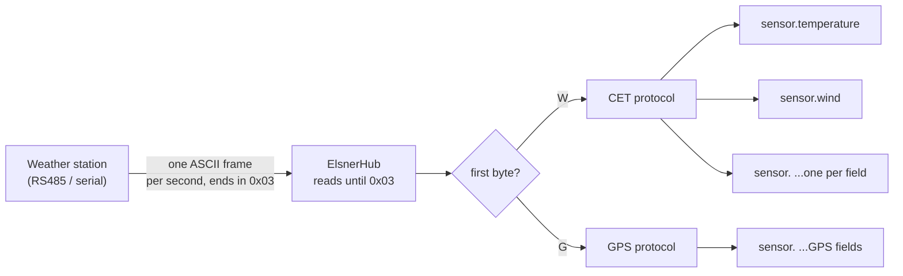

# Elsner Weather Station (P03/3-RS485)


A Home Assistant custom integration for the **Elsner P03/3-RS485** weather
station family (temperature, wind, sun brightness, rain, daylight). It talks
to the station over its RS485/serial output and exposes each measurement as
its own Home Assistant sensor entity — no `template:` sensors or manual
string-slicing required.

Both frame shapes the device can send are supported out of the box: **CET**
(`W...` frames) and **GPS** (`G...` frames, adding UTC time and sun azimuth/
elevation/position). Nothing to configure — the integration detects which
one your station sends from the first byte of the first frame and builds
the matching entities automatically (see [How it works](#how-it-works)).

## Compatible hardware

The Elsner P03/3-RS485 appears to be sold under other brand names as well,
seemingly the same hardware with an OEM label. These are reported to use the
same RS485 ASCII protocol (`W`/`G` frames as described below), so this
integration should work with them unmodified — but that's based on the specs
looking identical, not on having tested each one directly, so treat it as
"likely compatible" rather than guaranteed until confirmed against a real
serial log.

| Brand              | Model         | Approx. price | Product page                                                                                                                                     |
|---------------------|---------------|:---------------:|-----------------------------------------------------------------------------------------------------------------------------------------------|
| Elsner Elektronik    | P03/3-RS485   | €408           | [elsner-elektronik.de](https://www.elsner-elektronik.de/en/p03-3-rs485.html)                                                                    |
| Eltako               | WMS 485       | €400           | [eltako.com](https://www.eltako.com/en/catalog/products/17/wms) · [conrad.be](https://www.conrad.be/nl/p/eltako-wms-multisensor-voor-weergegevens-opbouw-op-muur-3398210.html) |
| PEHA (by ABB)        | WES 940       | €1000          | [portal.vanegmond.nl](https://portal.vanegmond.nl/producten/peha-fysische-sensor-bussysteem-d-940-wes/2077988)                                  |

If you're running this integration against one of the other brands, an issue
or PR confirming it (ideally with a raw serial log captured the same way as
the frames this protocol table was built from) is very welcome — it turns
"likely compatible" into a confirmed entry in this table.

## How it works

The weather station streams one ASCII frame per second, terminated with an
ETX (`0x03`) byte. In practice there are only two frame shapes: frames
starting with `W` (weather data only - the CET variant) and frames starting
with `G` (adds GPS/UTC time and sun position). The integration opens the
serial port once, reads frame by frame, **auto-detects which protocol is in
use from that first byte**, and fans the parsed values out to one sensor
entity per field:


```mermaid
flowchart LR
    A["Weather station<br/>(RS485 / serial)"] -->|"one ASCII frame<br/>per second, ends in 0x03"| B["ElsnerHub<br/>reads until 0x03"]
    B --> E{"first byte?"}
    E -->|"W"| C1["CET protocol"]
    E -->|"G"| C2["GPS protocol"]
    C1 --> D1["sensor.temperature"]
    C1 --> D2["sensor.wind"]
    C1 --> D3["sensor. ...one per field"]
    C2 --> D4["sensor. ...GPS fields"]
```

The protocol is detected once, from the very first frame the integration
sees after startup - the field entities are then created to match. Reading
frame-by-frame (rather than a fixed byte count) matters because the frame
length differs per protocol variant and because a fixed-size read can drift
out of sync with the actual frame boundaries over time.

## Installation

1. Copy the `elsner` folder into `<config_dir>/custom_components/elsner/`,
   so you end up with `<config_dir>/custom_components/elsner/manifest.json`,
   `sensor.py`, `protocols.py`, etc.
2. Restart Home Assistant.
3. Add a `sensor:` entry to your `configuration.yaml` (see below).
4. Restart Home Assistant again so the new requirement
   (`pyserial-asyncio-fast`) is installed.

## Configuration

```yaml
# configuration.yaml
sensor:
  - platform: elsner
    name: weather_station
    serial_port: /dev/ttyACM1
```

| Parameter      | Required | Default            | Description                                                                                     |
|----------------|:--------:|---------------------|---------------------------------------------------------------------------------------------------|
| `platform`     | yes      | –                   | Must be `elsner`.                                                                                  |
| `serial_port`  | yes      | –                   | Path to the serial device the station is connected to, e.g. `/dev/ttyACM1` or `/dev/ttyUSB0`.     |
| `name`         | no       | `Weather station`   | Base name used as a prefix for every generated entity, e.g. `weather_station` → `sensor.weather_station_temperature`. |

There's no `variant` setting to get wrong: the integration reads the first
byte of the first frame it receives (`W` or `G`) and builds the matching
entities automatically. Entities only appear once that first frame has been
read, so give it a second or two after startup.

The baud rate (19200) is fixed to match the station's datasheet and isn't
configurable.

> **Multiple stations:** add a second `- platform: elsner` block with its
> own `serial_port` and a different `name`; each block gets its own serial
> connection and its own set of entities.

## Entities

With `name: weather_station` and a station sending **CET** (`W...`) frames,
the integration creates:

| Entity                                | Type    | Unit  | Description                                  |
|----------------------------------------|---------|-------|-----------------------------------------------|
| `sensor.weather_station_temperature`   | float   | °C    | Outdoor temperature                           |
| `sensor.weather_station_wind`          | float   | m/s   | Wind speed                                    |
| `sensor.weather_station_sun_south`     | int     | klx   | South-facing brightness sensor                |
| `sensor.weather_station_sun_west`      | int     | klx   | West-facing brightness sensor                 |
| `sensor.weather_station_sun_east`      | int     | klx   | East-facing brightness sensor                 |
| `sensor.weather_station_daylight`      | int     | lx    | General daylight level                        |
| `sensor.weather_station_twilight`      | bool    | –     | `true` below ~10 lx                           |
| `sensor.weather_station_rain`          | bool    | –     | `true` while the heated rain sensor is wet    |
| `sensor.weather_station_weekday`       | str     | –     | ISO weekday of the station's clock, `1`–`7`   |
| `sensor.weather_station_day`           | int     | –     | Day of month (station's clock)                |
| `sensor.weather_station_month`         | int     | –     | Month (station's clock)                       |
| `sensor.weather_station_year`          | int     | –     | Two-digit year (station's clock)              |
| `sensor.weather_station_hour`          | int     | –     | Hour (station's clock, CET)                   |
| `sensor.weather_station_minute`        | int     | –     | Minute                                        |
| `sensor.weather_station_second`        | int     | –     | Second                                        |
| `sensor.weather_station_summer_time`   | str     | –     | `J` = daylight saving active, `N` = not, per the station's clock |

Wind is reported in m/s straight from the datasheet; multiply by 3.6 in a
template sensor if you'd rather have km/h.

If your station instead sends **GPS** (`G...`) frames, you get a different
set of entities — the shared measurements (temperature, sun, wind, rain)
plus UTC time and sun position instead of local date/time:

| Entity                                        | Type  | Unit  | Description                                      |
|-------------------------------------------------|-------|-------|-----------------------------------------------------|
| `sensor.weather_station_temperature`             | float | °C    | Outdoor temperature                                 |
| `sensor.weather_station_wind`                    | float | m/s   | Wind speed                                          |
| `sensor.weather_station_sun_south`               | int   | klx   | South-facing brightness sensor                      |
| `sensor.weather_station_sun_west`                | int   | klx   | West-facing brightness sensor                       |
| `sensor.weather_station_sun_east`                | int   | klx   | East-facing brightness sensor                       |
| `sensor.weather_station_daylight`                | int   | lx    | General daylight level                              |
| `sensor.weather_station_twilight`                | bool  | –     | `true` below ~10 lx                                 |
| `sensor.weather_station_rain`                    | bool  | –     | `true` while the heated rain sensor is wet          |
| `sensor.weather_station_weekday`                 | str   | –     | UTC weekday, `1`–`7`, or `?` if not synced          |
| `sensor.weather_station_day`                     | int   | –     | UTC day of month                                    |
| `sensor.weather_station_month`                   | int   | –     | UTC month                                           |
| `sensor.weather_station_year`                    | int   | –     | UTC two-digit year                                  |
| `sensor.weather_station_hour`                    | int   | –     | UTC hour                                            |
| `sensor.weather_station_minute`                  | int   | –     | UTC minute                                          |
| `sensor.weather_station_second`                  | int   | –     | UTC second                                          |
| `sensor.weather_station_gps_status`              | int   | –     | `1` = GPS fix OK, `0` = not OK                      |
| `sensor.weather_station_azimuth`                 | float | °     | Sun azimuth                                         |
| `sensor.weather_station_elevation`               | float | °     | Sun elevation                                       |
| `sensor.weather_station_longitude_direction`     | str   | –     | `O` (east) or `W` (west)                            |
| `sensor.weather_station_longitude`               | float | °     | Longitude, unsigned — combine with the direction above |
| `sensor.weather_station_latitude_direction`      | str   | –     | `N` (north) or `S` (south)                          |
| `sensor.weather_station_latitude`                | float | °     | Latitude, unsigned — combine with the direction above  |

A station only ever sends one of these two frame shapes, so you'll only ever
see one of these two entity sets for a given `serial_port`.

### Example Lovelace card

```yaml
type: entities
title: Weather station
entities:
  - sensor.weather_station_temperature
  - sensor.weather_station_wind
  - sensor.weather_station_sun_south
  - sensor.weather_station_sun_west
  - sensor.weather_station_sun_east
  - sensor.weather_station_daylight
  - sensor.weather_station_twilight
  - sensor.weather_station_rain
  - sensor.weather_station_weekday
  - sensor.weather_station_day
  - sensor.weather_station_month
  - sensor.weather_station_year
  - sensor.weather_station_hour
  - sensor.weather_station_minute
  - sensor.weather_station_second
  - sensor.weather_station_summer_time
```

## Architecture

The integration is split into three layers so that supporting another
protocol variant never touches the parts that already work:

- **`protocols.py`** — pure data. Each variant (`cet`, `gps`) is an
  ordered tuple of `Field`s, each with its byte offsets (straight from the
  Elsner datasheet), unit, and type cast. This is the *only* file you touch
  to add a variant.
- **`ElsnerHub`** — owns the single serial connection for a configured
  platform entry. It reads one frame at a time up to the `0x03` terminator.
  On the first frame it ever sees, it looks at the start byte (`W` or `G`),
  picks the matching protocol, and builds the entities for that protocol's
  fields on the spot. From then on it discards anything that doesn't start
  with that same byte (auto-resync on a corrupted or truncated frame),
  parses each frame via `protocols.parse_frame()`, and pushes the resulting
  dict to every registered entity.
- **`ElsnerFieldSensor`** — one lightweight entity per field. It just reads
  its own key out of whatever dict the hub last handed it.

A `verify_checksum()` helper in `protocols.py` is also available if you want
the hub to drop frames whose checksum doesn't match (the CET variant's
checksum was verified against real captured frames during development and
matches).

## Both frame shapes are already implemented

Earlier versions of this README described GPS support as a TODO. That's
done now: `protocols.py` has both `CET_FIELDS` and `GPS_FIELDS` filled in
from the datasheet's byte tables, and both are registered in `PROTOCOLS`.
There's nothing left to fill in for either shape the device can send.

If Elsner ever ships a third frame variant, the same pattern still applies:
add a `Field` tuple for it in `protocols.py` and register it in `PROTOCOLS`
with its start byte — `sensor.py` and `ElsnerHub` don't need any changes,
since they already read whichever protocol matches the frame's first byte
and build entities from its field list.


## Testing tools

This repo includes two ways to test the protocol without necessarily
having Home Assistant running yet.

### Windows tool

[`WetterstationCOM_13.zip`](https://github.com/v12345vtm/Elsner-Meteo_peha/blob/main/WetterstationCOM_13.zip)
is a small Windows tool for talking to a real weather station directly, to
verify wiring and read its data before pointing Home Assistant at it.

**You'll need:**
- An RS485-to-USB dongle.
- A 24V DC power supply for the weather station.

**Setup:**
1. Power the weather station with 24V DC.
2. Connect the station's `A` and `B` data terminals to the corresponding
   `A`/`B` terminals on the RS485-to-USB dongle.
3. Plug the dongle into your Windows PC via USB.
4. Run the tool, select the dongle's COM port, and you should see live
   frames coming from the station.

This is the quickest way to confirm your wiring is correct and to capture a
raw log of real frames (like the ones this protocol was reverse-engineered
from) before troubleshooting anything on the Home Assistant side.

### Arduino simulator

For testing without a physical weather station connected, this repo also
includes an Arduino sketch that acts as a simulator: it plays back a set of
sample `W`-frames (one per second, matching the real device's timing) over
its USB COM port.

Flash it to any Arduino board, plug it into your Home Assistant machine (or
the machine running the Windows tool above), and point `serial_port` (or
the Windows tool's COM port selector) at the Arduino's port instead of a
real weather station — useful for developing


## Credits

Protocol details taken from the Elsner *P03/3-RS485-GPS/CET Weather Station*
datasheet (version 23.10.2023).
